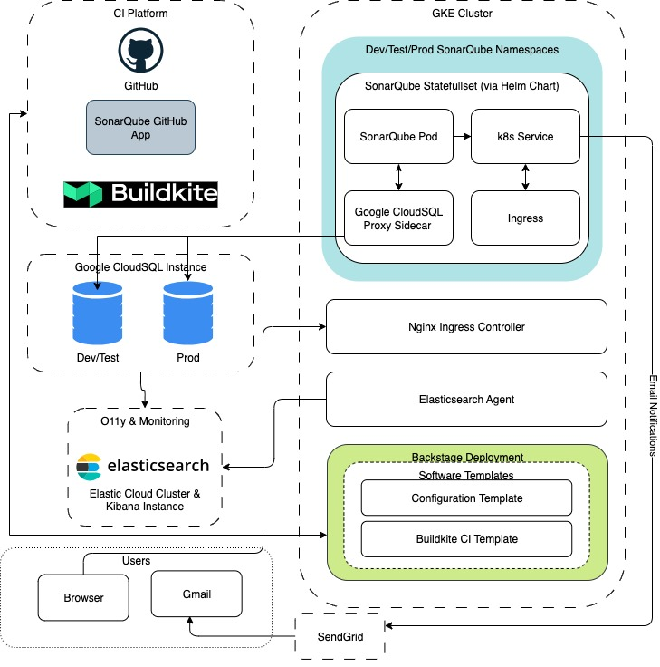
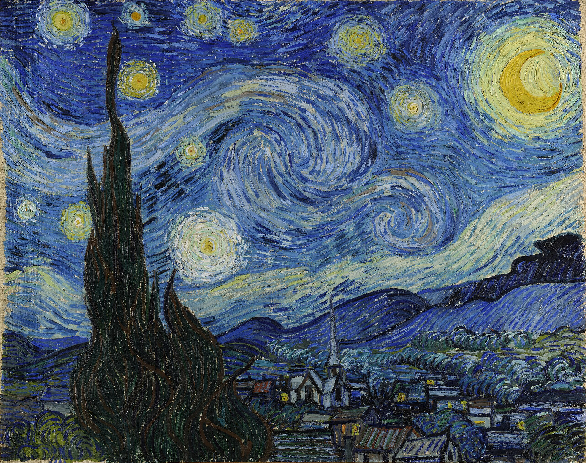
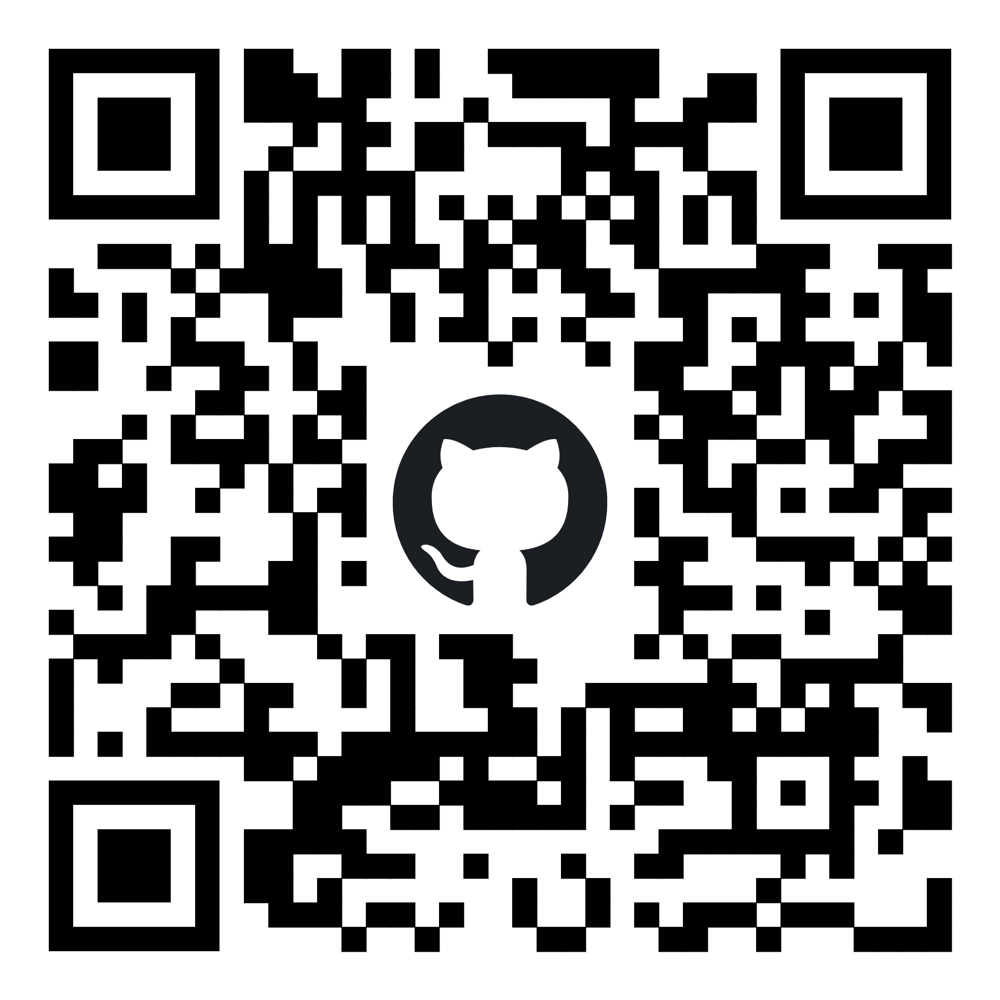

<!-- GLOBAL STYLE CONFIG -->
<style>
footer {
  font-size: 12px;
}
</style>

# Building a Foundation for Quality & Release Readiness
My SonarQube Enterprise Journey

https://rhass.github.io/relativity/slides.html

---
# About Me

### Hobbies / Interests
- 🏕️ Hiking, Backpacking, and Camping.
- ✈️ Building & flying fixed-wing RC aircraft.
- 📚 Tinkering & learning new things.

### Volunteering
- 🍪 Girl Scout Dad & LNT Advocate.
- 👷 Trail crews and cleanup of outdoor spaces.


<!-- _footer: "Image Source: © 2025 Ryan Hass. All Rights Reserved" -->

--- 
<style scoped>
  section {
    font-size: 16px;
  }
</style>

# My Career Journey
_Ascending order_
### Linspire 
- Started to learn how to create debian packages.
- Performed hardware compatibility testing for various hardware vendors.
### Dakim
- Transformed package build and release process.
### Rapid7
- Introduced Infrastructure-as-Code and Configuration-as-Code using Chef and Terraform for building VMWare and AWS infrastructure.
- Transformed manual Jenkins server and worker build/config into fully automated Chef cookbooks.
- Created Chef based automation for provisioning Nexpose product for QA testing in consistent and reliable manner.


<!-- _footer: "Image Source: [https://us.suunto.com](https://us.suunto.com/cdn/shop/files/4_cd2701a8-80ed-4f12-811c-a1ff45a7b20d.png?v=1719384679&width=1600)" -->

---
<style scoped>
  section {
    font-size: 16px;
  }
</style>

# My Career Journey
_Ascending order_
### Chef Software 
- Added Windows Support to Omnibus-Toolchain leveraging msys2 to support native Windows builds.
- Created the initial implementation of Scaffolding for Chef Habitat to simplify the onboarding experience.
### Elastic (Elasticsearch)
- Engineered and managed the full lifecycle of self-hosted SonarQube Enterprise infrastructure, from POC through production rollout, user onboarding, and subsequent maintenance.
- Integrated Quality Gates into CI/CD to automate code quality checks.
- Integrated into Backstage Internal Developer Platform for organic adoption.
- Jenkins to Buildkite CI migration.
- Makefile to Gradle build migration for Cloud Platform.


<!-- _footer: "Image Source: [https://us.suunto.com](https://us.suunto.com/cdn/shop/files/4_cd2701a8-80ed-4f12-811c-a1ff45a7b20d.png?v=1719384679&width=1600)" -->

---
# Project Overview

## Goals
- Engineering mandate to improve overall quality.
- Provide quality gates at each stage of the development lifecycle, in this case at PR stage. 
- Centralize Security/Static Analysis.
- Provide comprehensive Code Coverage metrics.
- Identify Lines-of-Code (LoC) requirement for licensing and budget.
- Easy to use.

---
# Project Overview
## Initial Constraints
- Must be able to support large number of globally distributed engineers.
- Multi-language support. Scala, Python, TypeScript, Go, and Rust.
- Must integrate with GitHub, Gradle, Buildkite, and Backstage Internal Developer Platform.
- Production environment must fulfill the "Production Readiness Review" requirements and get approval. ⚠️ _External dependency!_
- Product must pass internal security review. ⚠️ _External dependency!_ 

---
# Project Overview
## Buy vs Build
- Cheaper to buy. Core competencies on team and in company are elsewhere.
- SonarQube is widely used and understood.
- SonarQube Enterprise provided the features we needed.
- Security team was already interested in using SonarQube, easier to acquire budget.
- SonarQube Enterprise quickly scales to support the entire company.

---
# Project Overview
## Key Constraints Identified in PoC
- SonarCloud (SaaS) did not have feature parity with SonarQube Enterprise.
  - Limited configuration of scanning profiles.
  - No SAST support.
  - Limited reporting features.
- SonarQube Enterprise does not support HA.
- Needed to support ~5M LoC for the initial target repos.

---
# Architecture Overview
#### Infrastructure



<!-- _footer: "Diagram created using diagrams.net by Ryan Hass.\n Inspired by SonarQube, 'Reference Architecture for Developer Edition/Enterprise Edition (up to 10 M LOC)':\n https://docs.sonarsource.com/sonarqube-server/10.8/setup-and-upgrade/reference-architectures/up-to-10m-loc/ " -->

---
#### Terraform Build
HCL Broken into three modules:
  - CloudSQL Proxy (Not a true sidecar, really a separate deployment).
  - SonarQube Shared Infra and Config between environments.
  - SonarQube Helm Chart deployment. 

Dev/Test Builds:
  - Lint
  - Dry-Run

Production Build:
  - Merge to main triggers `apply` to production.

---
#### Buildkite Scanner Build
- Abstracted away configuration.
- Build on upstream image: `docker.io/sonarsource/sonar-scanner-cli`
- Sends Slack notifications to monitoring channel when failures occurred. (Good SNR, but reactive.)
- Provided integration tests for SonarQube itself.
  - PR builds run only when changes to buildkite-scanner subdirectory.
  - Always built when merged to main.
- Made adoption easy!

---
<style scoped>
  section {
    font-size: 16px;
  }
</style>
#### Buildkite Scanner Container Usage
`.buildkite/pipeline.yaml`
```yaml
# Tests can have multiple steps for unit, functional, and integration tests..
- label: ":test_tube: Running Tests"
  key: "tests"
  command: "make test"
  artifact_paths:
    - "coverage.out"

- label: ":sonarqube: Continuous Code Inspection"
  env:
    VAULT_SONAR_TOKEN_PATH: "kv/example/my-token"
  agents:
    image: "example.registry.notreal/buildkite-scanner:latest"
  depends_on:
    - "tests"
  command:
  # Download the saved coverage report from the `tests` step.
    - "buildkite-agent download coverage.out"
  allow_dependency_failure: true
    retry:
      manual:
        allowed: true
```
<!--- _footer: "Not proprietary information.\nApache License
Version 2.0 example derived from my work: https://github.com/elastic/logstash/blob/main/.buildkite/pull_request_pipeline.yml#L63-L82" -->

---
<style scoped>
  section {
    font-size: 20px;
  }
</style>
# Retrospective
### What went well
- Backstage integration.
- Organic adoption and user growth.
- Addressed the quality gate requirement fairly well at PR stage.
- Coverage metrics improved over time.
- SAML Integration with Okta.
- Fixed a liveness check, and PR was accepted! https://github.com/SonarSource/helm-chart-sonarqube/pull/325

<!--- _footer: "Image Source:x" -->
---
# Retrospective
<style scoped>
  section {
    font-size: 20px;
  }
</style>
### What didn't go well
- SonarQube bugs were common in non-LTS releases.
- Scala toolchain upgrade broke coverage reporting for Scala codebase.
- Go built-in reports are inaccurate, resulting in developer distrust of metrics. (No branch coverage.)
- Scanning Kibana.
- Okta Groups & GitHub Teams.
- User adoption of mitigation workflow.


<!--- _footer: "Image Source: Google Gemini, Prompt: 'Paint a house on fire in Van Gogh style.'" -->

---
# Retrospective
<style scoped>
  section {
    font-size: 20px;
  }
</style>
### What would I do differently?
- Separate Dev/Test and Production CloudSQL instances.
  - Connection string is used for licensing.
  - Improve backup and restore as result.
- Use ArgoCD.
- Dev environment using Kind for local development. https://kind.sigs.k8s.io/
- Backstage to address Team/Group sync.
- Turn buildkite steps into plugin.
- Enable public access to Elastic SonarQube for specific OpenSource projects.
- Sync test environment after production release.


<!--- _footer: "Image Source: Google Gemini, Prompt: 'Make a daytime version of the famous van gogh starry night with clouds and no moon or stars, set during daytime or sunrise.'" -->
---
# What did I learn?
- Convention over Configuration.
  - Leveraging the Internal Developer Platform templating for new projects was key to adoption.
- Ownership hand-off.
- Depending on a vendor with a limited support contract is painful.
- May not be the right solution for everyone.

---
# Why Relativity Space?
### How is the SonarQube project related to the work I'll be doing at Relativity Space?
- Lead project plans and proposals.
- Coordinated across multiple teams and stakeholders.
- Standardized CI process leveraging Backstage Internal Developer Platform.
- Managed releases processes.
- Built and released binary artifacts used by entire engineering org.
- Performed support in post-production to users.
- Infrastructure-as-Code.

---
# Why Relativity Space?
## Why am I good fit for Relativity?
- Relevant skill-set.
- Excellent communication skills.
- Experienced with cross-team collaboration.
## Why is Relativity a good fit for me?
- Professional growth opportunity.
- Culture and values align with growth mindset.

---
# One more thing...

---
# Built with GitHub Actions 😁

GitHub: https://github.com/rhass/relativity


<!-- _footer: "Github Logo Source: https://brand.github.com/foundations/logo"-->
---
# Thank You! Questions?

